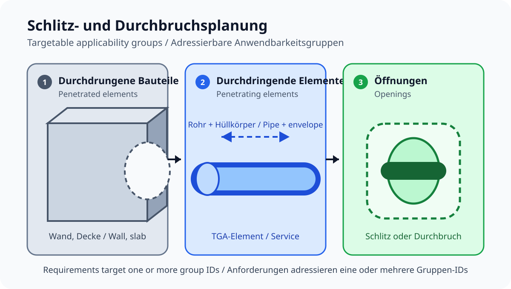

# Openings and penetrations / Schlitz- und Durchbruchsplanung

Bilingual coordination rules for reserved openings, service penetrations, host cuts,
installation allowances, and protected openings. The 25 mm allowance is an
editable example project policy, not a statutory value. Die Zugabe von 25 mm ist
eine bearbeitbare beispielhafte Projektvorgabe und kein gesetzlicher Wert.

## Applicability groups / Anwendbarkeitsgruppen

Every rule names the element populations that participate in its check:

- `penetrated-elements`: walls and slabs that are penetrated;
- `penetrating-elements`: pipes and other distribution elements;
- `openings`: slots and penetrations represented by opening elements.

The service-or-fill rule additionally names `filling-elements`; this keeps its
alternative relationship explicit instead of hiding it in prose.

Requirements target one or more of these stable group IDs. The group selectors
express scope only. They do not infer relationships or execute geometry. Those
semantics remain with each definition's declared trusted capability.

Jede Regel benennt die Bauteilgruppen, die an ihrer Prüfung beteiligt sind:

- `penetrated-elements`: durchdrungene Wände und Decken;
- `penetrating-elements`: Rohre und andere TGA-Elemente;
- `openings`: als Öffnungselemente modellierte Schlitze und Durchbrüche.

Die Regel für TGA-Element oder Füllung benennt zusätzlich `filling-elements`.
Damit bleibt die alternative Beziehung explizit, statt nur im Text verborgen
zu sein.

Anforderungen adressieren eine oder mehrere dieser stabilen Gruppen-IDs. Die
Gruppenselektoren beschreiben nur den Umfang. Sie leiten keine Beziehungen ab
und führen keine Geometrie aus. Diese Semantik bleibt bei der deklarierten,
vertrauenswürdigen Fähigkeit der jeweiligen Definition.

## Sources

- [buildingSMART IFC 4 ADD2 TC1](https://technical.buildingsmart.org/standards/ifc/ifc-schema-specifications/), `Pset_OpeningElementCommon`.
- [buildingSMART IFC 4 ADD2 TC1](https://technical.buildingsmart.org/standards/ifc/ifc-schema-specifications/), `Qto_OpeningElementBaseQuantities`.

The package cites identifiers and models requirements; it does not republish normative text.
